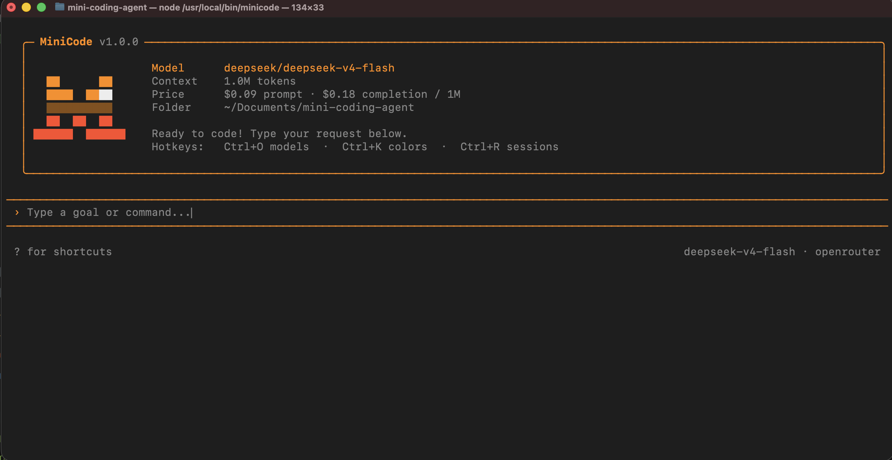

<p align="center">
  
</p>

<h1 align="center">MiniCode</h1>

<p align="center">
  <a href="https://www.npmjs.com/package/myminicode"></a>
  <a href="https://github.com/Ananthakrishna24/mini-coding-agent/stargazers"></a>
  
  
</p>

<p align="center">
  <em>Every coding agent started small, then drowned in plugins, configs, and abstractions.</em><br>
  <strong>MiniCode is what they were before the bloat.</strong>
</p>

<p align="center">
  A whole agent you can read in an afternoon — reads files, writes code, runs commands,<br>
  remembers, and spawns helpers. Everything the big ones do, none of the weight.
</p>

<div align="center">
<pre>
⠀⠀⠀⠀⢀⣠⡶⣾⣓⢦⣠⣴⣶⢦⣄⡀⠀⠀⠀⠀⠀⠀
⠀⠀⠀⣰⡟⠋⠕⠁⠀⠀⠀⣀⠈⠙⠞⢿⣦⠀⠀⠀⠀⠀
⠀⠀⡜⠙⠀⠀⠀⡠⠔⢈⡭⠤⠬⠭⣒⢄⠹⡀⠀⠀⠀⠀
⠀⢸⠀⠀⠀⢀⡰⠁⡴⠁⠀⠀⠀⣠⣌⢣⢣⣱⡀⠀⠀⠀
⠀⣿⣷⣿⣿⡿⡇⠐⡅⠀⠀⠀⠈⠿⠾⠀⡏⠿⠃⠀⠀⠀
⠀⠘⠀⠀⠈⠉⠹⡀⢣⡀⠀⠀⠀⠀⢀⡜⡸⠀⡀⠀⠀⠀
⠀⠀⡀⠀⠀⠀⠀⠈⠢⣙⠒⠤⠤⢒⡩⠞⠀⠀⡇⠀⠀⠀
⠀⠀⡇⠀⠀⠀⠀⠀⠀⠀⠀⠉⠉⠀⢀⠄⠀⠀⣱⠀⠀⠀
⠀⠐⣧⣀⠀⠀⠀⠀⠀⠀⠉⠀⠀⠉⠁⠀⣀⣴⣿⡅⠀⠀
⠀⢀⠟⢿⣷⣦⢤⣤⣤⣤⣴⣶⣶⣶⣿⣿⣯⡹⠃⡜⡄⠀
⠀⡜⢀⠄⠈⢻⣾⣿⣿⣿⣿⢟⣳⣾⣿⣿⣿⣷⣀⣇⡸⡀
⢠⢁⣼⣄⣀⣈⣿⣿⣿⣿⣻⠮⠡⣿⣾⣿⣿⣿⣿⣿⡿⠃
⠈⠦⢠⣿⣿⣿⣿⣿⣿⣿⣿⣿⣿⣿⣿⣿⣿⣿⠿⠃⠀⠀
⠀⠀⠀⠉⠛⠿⠿⠿⣿⣿⣿⡟⣿⣿⣿⠏⠉⠀⠀⠀⠀⠀
⠀⠀⠀⠀⠀⠀⠀⣾⠿⠿⠿⠃⠹⢿⡿⠀⠀⠀⠀⠀⠀⠀
</pre>
</div>

## Install

```bash
npm install -g myminicode
```

Then run anywhere:

```bash
minicode                          # interactive chat
minicode "fix the failing test"   # one-shot
```

## Providers

| Provider | Status |
|---|---|
| **OpenRouter** | ✅ ready |
| **OpenAI** | ✅ ready |
| **Anthropic** | ✅ ready |
| **Chinese models** (DeepSeek, Qwen, Kimi…) | 🚧 coming soon |

Drop in an API key and go — switch models anytime with `/model`.

## Usage

```bash
minicode                                # interactive chat
minicode "fix the failing test"         # one-shot — runs once, exits
minicode "add auth to the API"          # multi-step task in your repo
DEBUG=1 minicode                        # print per-turn context-budget lines
```

<p align="center"><sub>Built to stay small — <a href="https://github.com/Ananthakrishna24/mini-coding-agent">read the whole thing</a> in an afternoon.</sub></p>
